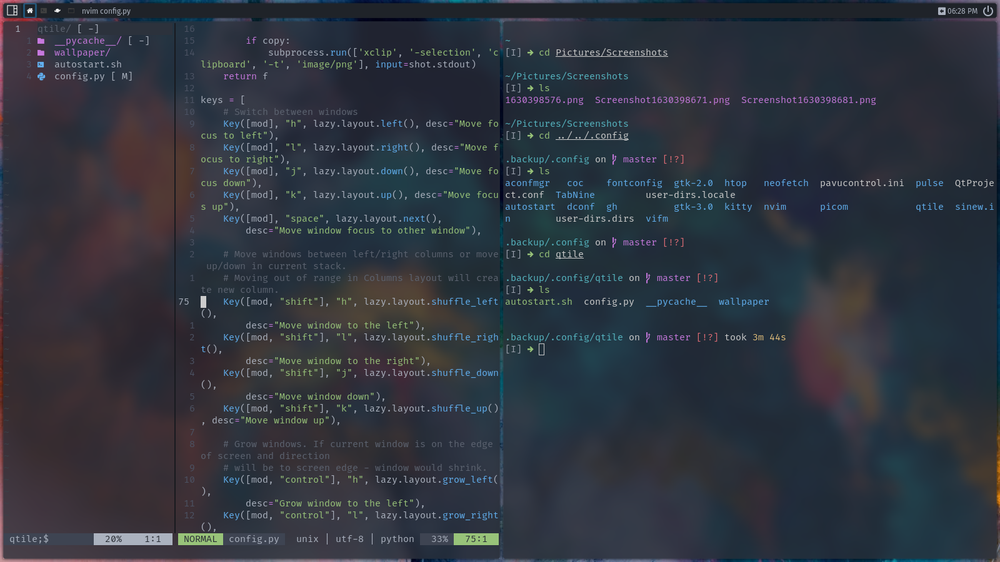

# Arch Config

My arch linux configuration files

## Screenshots




## Zsh Configuration

## Fonts

Instruction how to add fonts: [instruction](https://jichu4n.com/posts/how-to-set-default-fonts-and-font-aliases-on-linux)

## NeoVim
In order to configuration to work

```
sudo pacman -S figlet
```

## Future plans

There also would be instructions for install and some .sh executables in order to make process faster and easier
